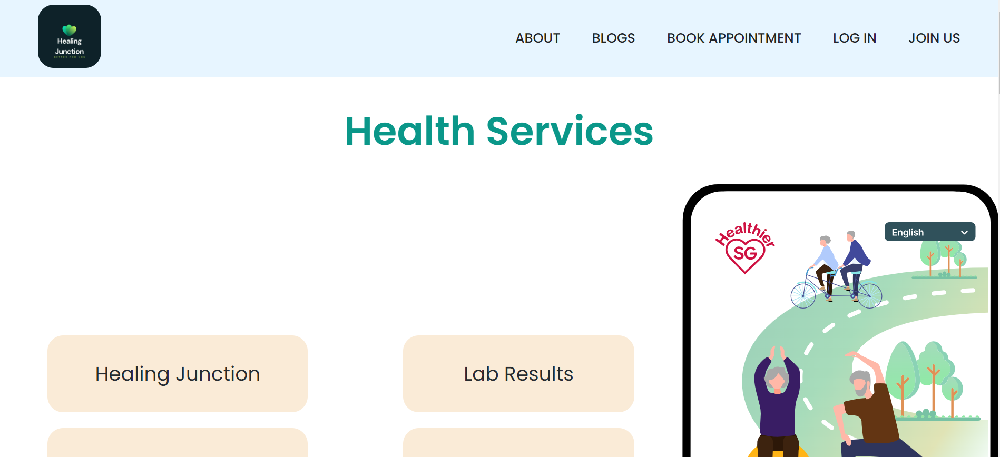
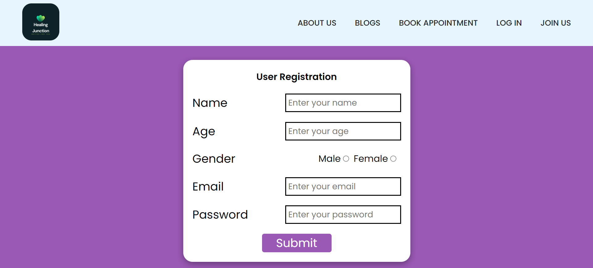
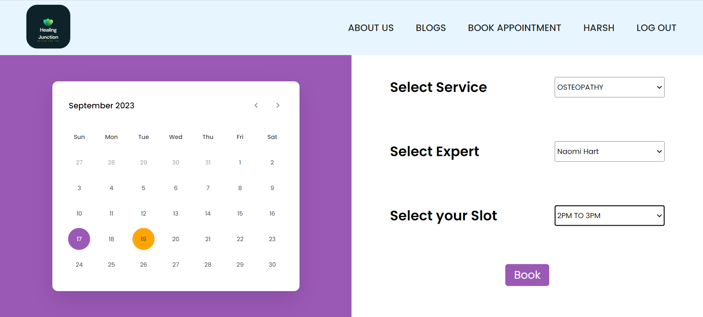
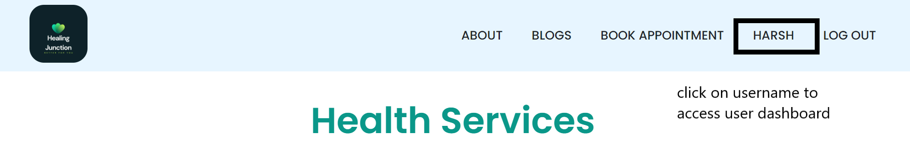
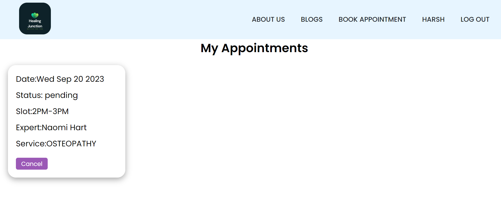
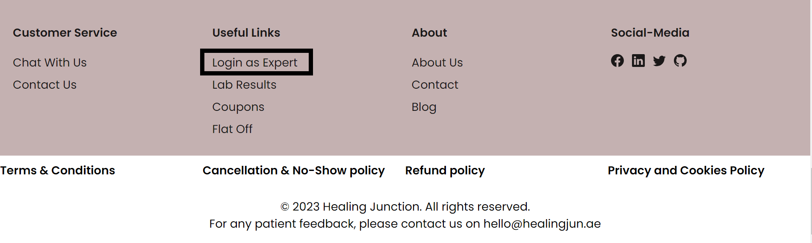
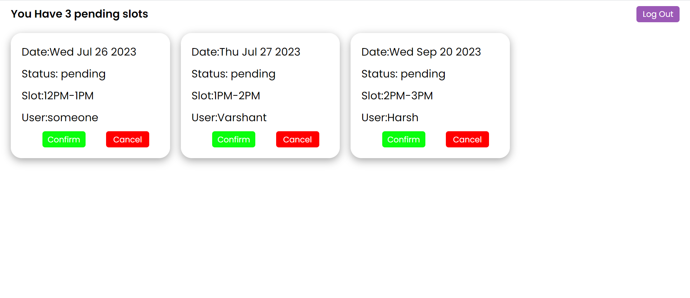

# Health Junction

Welcome to the README for the Health Junction project! This document provides an overview of the project, the technology stack used, deployment links, and includes screenshots to help you understand the project better.

## Introduction

Health Junction is a web-based healthcare appointment booking platform. Leveraging a tech stack that includes HTML, CSS, JavaScript, Node.js, Express.js, MongoDB, and bcrypt for security, I designed a user-friendly interface that facilitates seamless appointment scheduling between patients and doctors. The platform features user authentication, appointment management, doctor ,dashboards, and robust security measures

## Technology Stack

The project is built using a variety of technologies to ensure smooth functionality and an intuitive user experience:

- **Frontend**: The frontend is developed using **HTML**,**CSS** and **Javascript** . 

- **Backend**: The backend is powered by **Node.js** and **Express.js**, providing a robust server structure.
  
- **Database**: The game's data, user profiles, and game history are stored in a **MongoDB** database. This allows for efficient data management and retrieval.

## Deployment Links

- **Frontend Deployment**: The frontend of the Multilayer Chess Game is deployed on **Netlify**. You can access it [here](https://health-junction07.netlify.app/index.html).

- **Backend Deployment**: The backend is deployed on **Cyclic** to ensure a seamless multiplayer experience. Visit the backend at [https://nice-ruby-goose-fez.cyclic.app].

## Screenshots

Here are some screenshots showcasing the different aspects of the Multilayer Chess Game:

1. **Homepage**: The landing page provides info of the plans and services we provide.

   

2. **About**:About page gives info about the experts/doctors you can book appointment with.

   

3. **Blogs**: Learn more about your problems and health by reading bolgs by our experts.

   

4. **Signup**: Signup on our website to experience our services.

   

5. **Book Appointment**: Book your appointment with experts by selecting your prefferable date , service ,expert and time slots.

   

6. **User Dashboard**: See your appointments and their status by clicking on your username present in the nav bar .

   

7.**My Appointments**: See your appointments and their status .

   

8.  **Expert Login**: Click on this link in footer to login as expert and access expert dashboard .

   

9. **Expert dashboard**: This is how expert dashboard looks lik

   
   

Feel free to explore the deployed links .

## Get Started

To run the project locally, follow these steps:

1. Clone the repository: `git clone https://github.com/vaibhav-panwar/Health-Junction`
2. Open the Backend Folder to get your backend running
3. Install dependencies: `npm install`
4. Start the development server: `npm start`

Make sure to configure the backend URL in the frontend code for local development.
